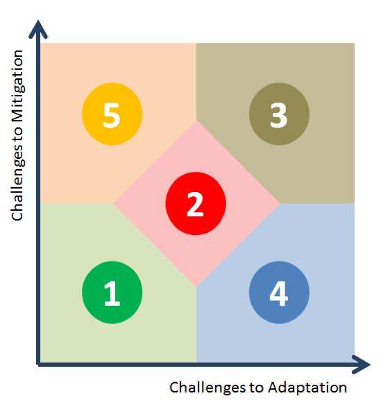

## GCAM SSP Scenario Results

### GCAM simulations of the Shared Socioeconomic Pathways

The [GCAM](http://www.globalchange.umd.edu/models/gcam/) model was one of six models used
in the quantification of the Shared Socioeconomic Pathways (SSP; Riahi et al., 2017). The
SSPs are new scenarios for climate change modeling and research (Moss et al. 2010, van
Vuuren et al., 2014). The five reference SSP scenarios assume no additional measures
explicitly designed to reduce greenhouse gas emissions.  Each of the five SSP scenarios
can also be quantified incorporating limits on 2100 radiative forcing (1.9, 2.6, 4.5, or
6.0, W/m2).  Scenarios with specific radiative forcing levels can be mapped to
corresponding CMIP climate model experiments as described in O’Neill et al. (2014).

The five SSPs are defined along two different axes: challenges to mitigation and
challenges to adaptation (see Figure below).

  Figure: SSPs defined by their Challenges to
Adaptation (x-axis) and Mitigation (y-axis) {: .fig}

Each of the models produced results for between three and five of the SSPs, with one model
identified as the “marker” for each SSP. GCAM was the marker model for the SSP4. Marker
models, and models providing additional scenario quantifications, for all SSPs are listed
in the Table below.

| Identifier | Descriptor | 

| Identifier	| Descriptor	| Marker model (institution)	| Also quantified by |
| --- | --- | --- | --- |
| SSP1	| Sustainability	| IMAGE-MAGNET (PBL, LEI)	| All |
| SSP2	| Middle-of-the-Road 	| MESSAGE-GLOBIOM (IIASA)	| All |
| SSP3	| Regional Rivalry	| AIM/CGE (NIES)	| GCAM, IMAGE, MESSAGE-GLOBIOM |
| SSP4	| Inequality	| GCAM (PNNL)	| AIM/CGE |
| SSP5	| Fossil-fueled Development 	| REMIND-MAgPIE (PIK)	| AIM/CGE, GCAM |

The data provided here are for the GCAM quantifications of the SSPs as described in
[Calvin et al.
(2017)](http://www.sciencedirect.com/science/article/pii/S095937801630084X). The GCAM data
for the SSP4 and the GCAM representation of all other SSPs are being made available to
interested researchers for scenario analysis and comparison. Please cite the following: 

> Calvin, K., B. Bond-Lamberty, L. Clarke, J. Edmonds, J. Eom, C. Hartin, S. Kim, P. Kyle, R. Link, R. Moss, H. McJeon, P. Patel, S. Smith, S. Waldhoff and M. Wise (2017). "The SSP4: A world of deepening inequality." Global Environmental Change 42: 284-296.

Note that the scenario data provided for use in CMIP6 is not exactly the same as the
original GCAM model results provided here. The CMIP6 data has undergone additional
processing to first harmonize emissions and land-use to the historical data used in CMIP6,
which are then mapped to spatial grids (Gidden et al. submitted). Gridded emission and
land-use data have been made available through 
[ESGF](https://esgf-node.llnl.gov/projects/input4mips/), with additional information and 
data available through the [SSP database](https://secure.iiasa.ac.at/web-apps/ene/SspDb/dsd?Action=htmlpage&page=about).

### Links to available data:

### Contacts
Kate Calvin

### Additional References
#### Overview Papers on the SSP Quantifications
Riahi, K., D. P. van Vuuren, E. Kriegler, J. Edmonds, B. C. O’Neill, S. Fujimori, N.
Bauer, K. Calvin, R. Dellink, O. Fricko, W. Lutz, A. Popp, J. C. Cuaresma, S. Kc, M.
Leimbach, L. Jiang, T. Kram, S. Rao, J. Emmerling, K. Ebi, T. Hasegawa, P. Havlik, F.
Humpenöder, L. A. Da Silva, S. Smith, E. Stehfest, V. Bosetti, J. Eom, D. Gernaat, T.
Masui, J. Rogelj, J. Strefler, L. Drouet, V. Krey, G. Luderer, M. Harmsen, K. Takahashi,
L. Baumstark, J. C. Doelman, M. Kainuma, Z. Klimont, G. Marangoni, H. Lotze-Campen, M.
Obersteiner, A. Tabeau and M. Tavoni (2017). "The Shared Socioeconomic Pathways and their
energy, land use, and greenhouse gas emissions implications: An overview." Global
Environmental Change 42: 153-168.

Bauer, N., K. Calvin, J. Emmerling, O. Fricko, S. Fujimori, J. Hilaire, J. Eom, V. Krey,
E. Kriegler, I. Mouratiadou, H. Sytze de Boer, M. van den Berg, S. Carrara, V. Daioglou,
L. Drouet, J. E. Edmonds, D. Gernaat, P. Havlik, N. Johnson, D. Klein, P. Kyle, G.
Marangoni, T. Masui, R. C. Pietzcker, M. Strubegger, M. Wise, K. Riahi and D. P. van
Vuuren (2017). "Shared Socio-Economic Pathways of the Energy Sector – Quantifying the
Narratives." Global Environmental Change 42: 316-330.

Popp, A., K. Calvin, S. Fujimori, P. Havlik, F. Humpenöder, E. Stehfest, B. L. Bodirsky,
J. P. Dietrich, J. C. Doelmann, M. Gusti, T. Hasegawa, P. Kyle, M. Obersteiner, A. Tabeau,
K. Takahashi, H. Valin, S. Waldhoff, I. Weindl, M. Wise, E. Kriegler, H. Lotze-Campen, O.
Fricko, K. Riahi and D. P. v. Vuuren (2017). "Land-use futures in the shared
socio-economic pathways." Global Environmental Change 42: 331-345.

Rao, S., Z. Klimont, S. J. Smith, R. Van Dingenen, F. Dentener, L. Bouwman, K. Riahi, M.
Amann, B. L. Bodirsky, D. P. van Vuuren, L. Aleluia Reis, K. Calvin, L. Drouet, O. Fricko,
S. Fujimori, D. Gernaat, P. Havlik, M. Harmsen, T. Hasegawa, C. Heyes, J. Hilaire, G.
Luderer, T. Masui, E. Stehfest, J. Strefler, S. van der Sluis and M. Tavoni (2017).
"Future air pollution in the Shared Socio-economic Pathways." Global Environmental Change
42: 346-358.

#### Socioeconomic Assumptions and SSP Storylines
Kc, S. and W. Lutz (2017). "The human core of the shared socioeconomic pathways:
Population scenarios by age, sex and level of education for all countries to 2100." Global
Environmental Change 42: 181-192.

Dellink, R., J. Chateau, E. Lanzi and B. Magné (2017). "Long-term economic growth
projections in the Shared Socioeconomic Pathways." Global Environmental Change 42:
200-214.

O’Neill, B. C., E. Kriegler, K. L. Ebi, E. Kemp-Benedict, K. Riahi, D. S. Rothman, B. J.
van Ruijven, D. P. van Vuuren, J. Birkmann, K. Kok, M. Levy and W. Solecki (2017). "The
roads ahead: Narratives for shared socioeconomic pathways describing world futures in the
21st century." Global Environmental Change 42: 169-180.

#### Quantifications of SSPs by different IAMs
van Vuuren, D. P., E. Stehfest, D. E. H. J. Gernaat, J. C. Doelman, M. van den Berg, M.
Harmsen, H. S. de Boer, L. F. Bouwman, V. Daioglou, O. Y. Edelenbosch, B. Girod, T. Kram,
L. Lassaletta, P. L. Lucas, H. van Meijl, C. Müller, B. J. van Ruijven, S. van der Sluis
and A. Tabeau (2017). "Energy, land-use and greenhouse gas emissions trajectories under a
green growth paradigm." Global Environmental Change 42: 237-250.

Fricko, O., P. Havlik, J. Rogelj, Z. Klimont, M. Gusti, N. Johnson, P. Kolp, M.
Strubegger, H. Valin, M. Amann, T. Ermolieva, N. Forsell, M. Herrero, C. Heyes, G.
Kindermann, V. Krey, D. L. McCollum, M. Obersteiner, S. Pachauri, S. Rao, E. Schmid, W.
Schoepp and K. Riahi (2017). "The marker quantification of the Shared Socioeconomic
Pathway 2: A middle-of-the-road scenario for the 21st century." Global Environmental
Change 42: 251-267.

Fujimori, S., T. Hasegawa, T. Masui, K. Takahashi, D. S. Herran, H. Dai, Y. Hijioka and M.
Kainuma (2017). "SSP3: AIM implementation of Shared Socioeconomic Pathways." Global
Environmental Change 42: 268-283.

Kriegler, E., N. Bauer, A. Popp, F. Humpenöder, M. Leimbach, J. Strefler, L. Baumstark, B.
L. Bodirsky, J. Hilaire, D. Klein, I. Mouratiadou, I. Weindl, C. Bertram, J.-P. Dietrich,
G. Luderer, M. Pehl, R. Pietzcker, F. Piontek, H. Lotze-Campen, A. Biewald, M. Bonsch, A.
Giannousakis, U. Kreidenweis, C. Müller, S. Rolinski, A. Schultes, J. Schwanitz, M.
Stevanovic, K. Calvin, J. Emmerling, S. Fujimori and O. Edenhofer (2017). "Fossil-fueled
development (SSP5): An energy and resource intensive scenario for the 21st century."
Global Environmental Change 42: 297-315.

#### Framework Papers
Moss, R. H., J. A. Edmonds, K. A. Hibbard, M. R. Manning, S. K. Rose, D. P. van Vuuren, T.
R. Carter, S. Emori, M. Kainuma, T. Kram, G. A. Meehl, J. F. B. Mitchell, N. Nakicenovic,
K. Riahi, S. J. Smith, R. J. Stouffer, A. M. Thomson, J. P. Weyant and T. J. Wilbanks
(2010). "The next generation of scenarios for climate change research and assessment."
Nature 463(7282): 747-756.

van Vuuren, D. P., E. Kriegler, B. C. O’Neill, K. L. Ebi, K. Riahi, T. R. Carter, J.
Edmonds, S. Hallegatte, T. Kram, R. Mathur and H. Winkler (2014). "A new scenario
framework for Climate Change Research: scenario matrix architecture." Climatic Change
122(3): 373-386.

#### CMIP6 Planning Papers
O'Neill, B. C., Tebaldi, C., van Vuuren, D. P., Eyring, V., Friedlingstein, P., Hurtt, G.,
Knutti, R., Kriegler, E., Lamarque, J.-F., Lowe, J., Meehl, G. A., Moss, R., Riahi, K.,
and Sanderson, B. M.: The Scenario Model Intercomparison Project (ScenarioMIP) for CMIP6,
Geosci. Model Dev., 9, 3461-3482, https://doi.org/10.5194/gmd-9-3461-2016, 2016. 

